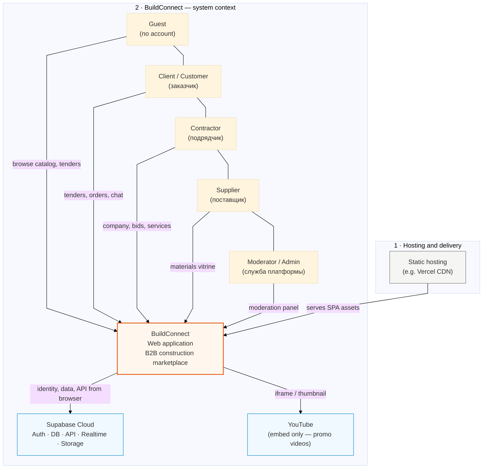
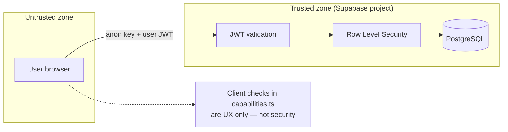

# 01 — System context (C4 Level 1)

**Purpose:** show BuildConnect in its environment — users, external systems, and the single software system boundary.

[← Architecture hub](../ARCHITECTURE.md) · [Next: Containers →](02-containers.md)

---

## Context diagram

> **Для draw.io:** вставляйте код из блока ниже (без HTML-тегов, ровно **2** subgraph). После импорта: **Arrange → Layout → Vertical Flow**, затем вручную выровняйте ряд акторов по горизонтали. Либо экспортируйте SVG с [mermaid.live](https://mermaid.live) и в draw.io: **File → Import → SVG**.

### Рекомендуемая раскладка в draw.io (если импорт «плывёт»)

Соберите **вручную** за 2 минуты — так стабильнее, чем автоконвертер:

| Слой | Содержимое | Позиция |
|------|------------|---------|
| **Верхняя рамка** | Один блок: Static hosting (Vercel CDN) | По центру сверху |
| **Стрелка вниз** | Подпись: `serves SPA assets` | |
| **Нижняя рамка** | Внутри сверху вниз: | |
| → Ряд из 5 прямоугольников | Guest, Client, Contractor, Supplier, Moderator | Одна линия |
| → Центр | **BuildConnect** (оранжевая заливка) | Под акторами |
| → Ряд из 2 блоков | Supabase, YouTube | Под BuildConnect |
| **Стрелки** | 5× актор → BuildConnect; 2× BuildConnect → сервисы | |

### Описание для документации (вставить рядом с диаграммой)

**Рисунок 1. Контекст системы BuildConnect (уровень C4 — System Context).**

На рисунке представлена система BuildConnect и её окружение. Диаграмма **вертикальная** и состоит из **двух логических зон** (subgraph).

**Зона 1 (верх) — Hosting and delivery.** Компонент *Static hosting* (например, Vercel CDN) выполняет одну функцию: раздаёт статические файлы фронтенда (собранное SPA из каталога `dist/`) в браузер клиента. Данные пользователей и компаний на CDN не хранятся.

**Зона 2 (низ) — BuildConnect — system context.** В этой зоне находятся все участники и интеграции предметной области:

1. **Внешние пользователи (акторы)** — пять ролей: гость (просмотр каталога и тендеров без регистрации), заказчик (тендеры, заказы, чат), подрядчик (компания, отклики, услуги), поставщик (витрина материалов), модератор/администратор (панель модерации). Каждый актор взаимодействует с одним программным компонентом — веб-приложением BuildConnect.

2. **BuildConnect (Web application)** — граница разрабатываемой системы. Это B2B-маркетплейс для строительной отрасли: каталог, заявки, чат, тендеры, верификация компаний. Реализация — одностраничное приложение на React.

3. **Внешние сервисы** — *Supabase Cloud* (аутентификация, PostgreSQL, REST API, Realtime, Storage) и *YouTube* (только встраивание промо-роликов на витрине `/feed`).

**Связи:** стрелка из зоны 1 в центр зоны 2 (*serves SPA assets*) означает доставку клиентского кода. Стрелки от акторов к BuildConnect — бизнес-сценарии. Стрелки от BuildConnect к Supabase и YouTube — вызовы API и загрузка медиа из браузера.

**Вывод:** BuildConnect — единая программная система в нижней зоне; хостинг статики — инфраструктурный слой над ней; Supabase и YouTube — внешние зависимости, без которых невозможны учётные записи, данные и промо-видео соответственно.

## System goal

Connect **customers** with **verified contractors** and **suppliers** in Kazakhstan’s construction sector: discovery (catalog, vitrines, promo feed), structured demand (tenders), and **deal-scoped chat** (requests).

## Scope inside BuildConnect

| In scope | Out of scope (current version) |
|----------|--------------------------------|
| User registration, profiles, roles | Payment gateway / escrow |
| Company profiles, portfolio, promo | Electronic signature (eGov) |
| Tenders, services, materials listings | Native mobile apps |
| Requests, realtime chat, attachments | Custom Node/Java API server |
| Reviews, verification, moderation | Full CRM / ERP |

## Trust boundaries

## Actor → primary journeys

| Actor | Primary journeys |
|-------|------------------|
| Guest | Home, catalog (read), company page (read), auth |
| Client | Create tender, order service/material, chat, review after completion |
| Contractor | Create company, verification, bid on tender, manage portfolio & promo |
| Supplier | Create company, publish materials, respond to requests |
| Moderator | Approve verification, handle reports, suspend/revoke, ban users |

---

[Next: Containers →](02-containers.md)
