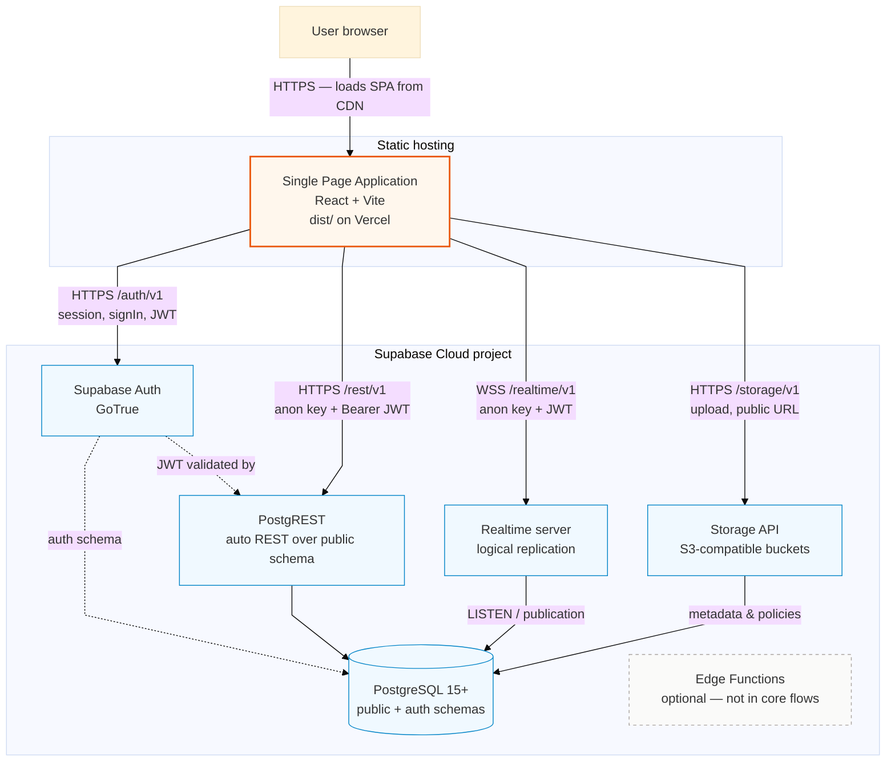
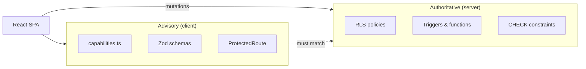

## Container diagram

> **Env:** один `VITE_SUPABASE_URL` и `VITE_SUPABASE_PUBLISHABLE_KEY` (anon) — база для всех четырёх вызовов из `supabase-js` (`src/integrations/supabase/client.ts`).

## Container responsibilities

| Container | Technology | Responsibility |
|-----------|------------|----------------|
| **SPA** | React 18, TypeScript | UI, routing, form validation (Zod), client capability checks, orchestrating API calls |
| **Supabase Auth** | Managed | Email/password sign-up, sessions, JWT refresh |
| **PostgREST** | Managed | CRUD on tables; enforces RLS per request |
| **PostgreSQL** | Managed | Data, triggers, functions, RLS policies |
| **Realtime** | Managed | Push `INSERT` on `messages`, `notifications` to subscribed clients |
| **Storage** | Managed | Binary objects; bucket-level policies |
| **Vercel (typical)** | CDN + SPA rewrite | Serves `index.html` for client routes (`vercel.json`) |

## Protocol matrix

| From | To | Protocol | Payload |
|------|-----|----------|---------|
| SPA | Auth | HTTPS `/auth/v1` | email, password, session, JWT (same project URL + anon key) |
| SPA | PostgREST | HTTPS `/rest/v1` | JSON rows, filters, RPC; `Authorization: Bearer` |
| SPA | Realtime | WebSocket `/realtime/v1` | `postgres_changes` subscriptions |
| SPA | Storage | HTTPS `/storage/v1` | multipart upload, public URLs |
| Auth | PostgreSQL | SQL | `auth` schema (users, sessions metadata) |
| PostgREST | PostgreSQL | SQL | parameterized queries + RLS on `public` |
| Realtime | PostgreSQL | logical replication | listens to published tables |
| Storage | PostgreSQL | SQL | object metadata, bucket policies |
| Triggers | PostgreSQL | — | side effects (notifications, ratings) |

## Data authority

## Environment configuration

| Variable | Consumer | Purpose |
|----------|----------|---------|
| `VITE_SUPABASE_URL` | SPA | Base URL for Auth, REST, Realtime, Storage (one Supabase project) |
| `VITE_SUPABASE_PUBLISHABLE_KEY` | SPA | Anon key on every API call (RLS-bound; not only Auth) |
| Supabase service role | **Not in SPA** | Migrations / admin scripts only |

## Scaling & limits (conceptual)

- **SPA:** horizontally scaled via CDN; stateless.  
- **Supabase:** connection pooling, RLS per row — suitable for diploma / SMB B2B scale.  
- **Heavy work** (PDF/DOCX contract export): runs **in browser** (`contractDocumentExport.ts`), not on server.

---

[Next: Core process →](03-core-process.md)

