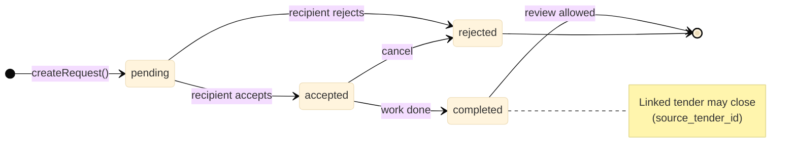

# 03 — Core business process

**Purpose:** request status lifecycle (diagram 3). See also [04 — sequence](04-request-sequence.md), [07 — marketplace](07-marketplace.md).

[← Containers](02-containers.md) · [Architecture hub](../ARCHITECTURE.md) · [Next: Sequence →](04-request-sequence.md)

---

## Central idea

Every marketplace action (catalog, tender bid, service/material order, promo CTA) creates:

1. a row in **`requests`** (`pending` → `accepted` / `rejected` → `completed`);
2. an initial row in **`messages`** (chat thread);
3. **`notifications`** via DB triggers; UI updates through **Realtime**.

Hooks: `src/hooks/useRequests.ts`, `src/hooks/useMessages.ts`, `src/pages/Chat.tsx`.

---

## Request status (diagram 3)

### Описание для документации (Рисунок 3)

**Рисунок 3. Жизненный цикл заявки (`requests.status`).**

Заявка — единый канал сделки между заказчиком и компанией (или профилем-получателем). После создания заявки автоматически создаётся первое сообщение в чате. Получатель переводит статус в «принята» или «отклонена»; по завершении работ — в «завершена», что открывает возможность отзыва. При связи с тендером завершённая заявка может закрыть тендер.

---

## Where requests come from (text only)

| Source | UI | Hook |
|--------|-----|------|
| Company profile | «Связаться» | `useCreateRequest` + `company_id` |
| Tenders | Bid | `source_tender_id` + company or `recipient_profile_id` |
| Services / Materials | Order | `services` listing → request |
| Promo feed | Contact | optional `promo_post_id` in first message |

Client checks: `src/lib/capabilities.ts`. Enforcement: **RLS** on `requests` / `messages`.

---

## Authentication & profile (text only)

- Registration: Supabase Auth → trigger `handle_new_user` → `profiles`.
- Session: `AuthProvider` (`src/contexts/AuthContext.tsx`).
- Incomplete profile → `/complete-profile` (`RequireCompleteProfile`).
- Protected pages → `ProtectedRoute`; staff → `/moderation`.

---

## Verification & moderation (text only)

| `verification_status` | Meaning |
|----------------------|---------|
| `draft` | Company created, docs not sent |
| `pending` | Awaiting moderator |
| `verified` | Visible in catalog / vitrines |
| `rejected` / `suspended` / `revoked` | Restricted; see `src/lib/companyVerification.ts` |

Moderation: `/moderation`, reports in `reports`, audit in `moderation_actions`.

---

## Security & storage (text only)

- **Authoritative:** PostgreSQL RLS + triggers (`supabase/migrations/`).
- **Advisory on client:** `capabilities.ts`, Zod, `ProtectedRoute`.
- **Storage buckets:** `avatars`, `logos`, `projects`, `company-documents`, `request-attachments`.

---

## Deployment

See **[DEPLOY_GUIDE.md](../../DEPLOY_GUIDE.md)** — Supabase Cloud, `.env`, Vercel, migrations, Auth URLs. No separate architecture diagram.

---

[Tables & routes →](09-reference.md)
