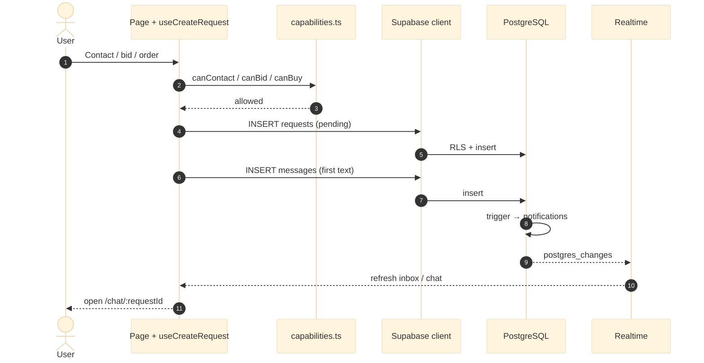

# 04 — Create request & chat (sequence)

**Purpose:** how a deal starts in the system — from UI action to database and Realtime.

[← Core process](03-core-process.md) · [Architecture hub](../ARCHITECTURE.md) · [Next: Data model →](05-data-model.md)

---

## Sequence diagram

### Описание для документации (Рисунок 4)

**Рисунок 4. Создание заявки и открытие чата.**

Пользователь инициирует сделку с карточки компании, тендера, витрины или промо-ленты. Клиент проверяет права (`capabilities.ts`), затем через Supabase API создаётся запись `requests` со статусом `pending` и первое сообщение в `messages`. Триггер в БД формирует уведомление получателю; подписчики Realtime обновляют список диалогов. Пользователь переходит на страницу чата по идентификатору заявки.

Implementation: `src/hooks/useRequests.ts` (`useCreateRequest`, `buildFirstChatMessage`).

---

[Next: Data model →](05-data-model.md)
