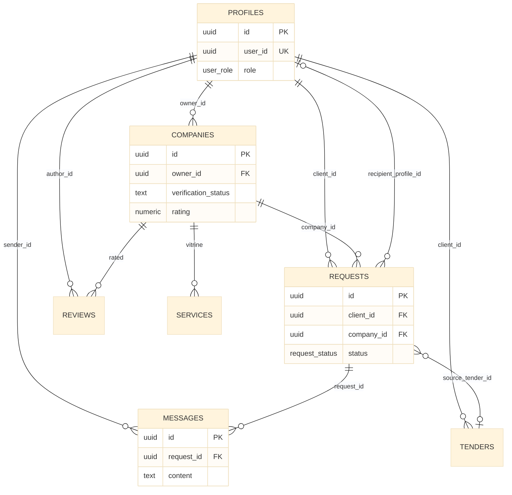

# 05 — Data model (core entities)

**Purpose:** main tables and relationships. Full schema: `supabase/migrations/`.

[← Request sequence](04-request-sequence.md) · [Architecture hub](../ARCHITECTURE.md) · [Next: Frontend →](06-frontend.md)

---

## ER diagram (core)

### Описание для документации (Рисунок 5)

**Рисунок 5. Логическая модель данных (основные сущности).**

Центр модели — **`requests`**: заявка связывает заказчика (`profiles` как `client_id`) с компанией-получателем (`companies`) или с профилем (`recipient_profile_id` при отклике на тендер без компании). **`messages`** хранят переписку в рамках одной заявки. **`tenders`** — объявления заказчика; отклик может ссылаться на тендер через `source_tender_id`. **`services`** — позиции витрины, принадлежащие компании. **`reviews`** возможны после завершённой заявки. Дополнительные таблицы (`notifications`, `company_documents`, `reports`, promo) см. [09-reference.md](09-reference.md).

---

## Domain groups (text)

| Group | Tables |
|-------|--------|
| Identity | `profiles`, `company_members` |
| Organization | `companies`, `company_categories` |
| Marketplace | `tenders`, `services`, `company_promo_posts` |
| Deal | `requests`, `messages`, `notifications` |
| Trust | `reviews`, `company_documents`, `reports` |

---

[Next: Frontend →](06-frontend.md)
