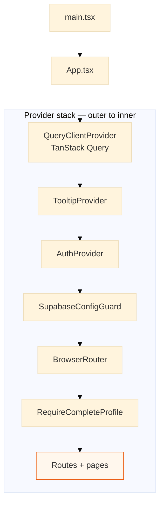
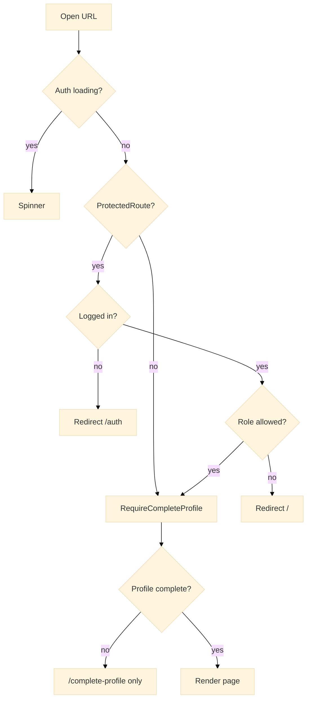

# 06 — Frontend structure

**Purpose:** React SPA composition — provider nesting and route guards.

[← Data model](05-data-model.md) · [Architecture hub](../ARCHITECTURE.md) · [Next: Marketplace →](07-marketplace.md)

---

## Provider stack (diagram 6)

### Описание для документации (Рисунок 6)

**Рисунок 6. Вложение провайдеров React-приложения.**

Сверху вниз показан порядок обёрток в `App.tsx`: кэш серверных данных, UI-подсказки, контекст авторизации, проверка переменных Supabase, маршрутизация, проверка заполненного профиля, затем дерево страниц (`Route`). Это не поток данных, а **композиция компонентов** — каждый внутренний уровень доступен всем дочерним страницам.

---

## Route guards (diagram 7)

### Описание для документации (Рисунок 7)

**Рисунок 7. Проверки доступа к маршрутам.**

Перед отображением страницы приложение проверяет сессию (`ProtectedRoute`), при необходимости — роль (например, модерация), затем полноту профиля (`RequireCompleteProfile`). Публичные маршруты (каталог, карточка компании) доступны без входа; чат и профиль — только авторизованным.

Files: `ProtectedRoute.tsx`, `RequireCompleteProfile.tsx`, `App.tsx`.

---

[Next: Marketplace →](07-marketplace.md)
