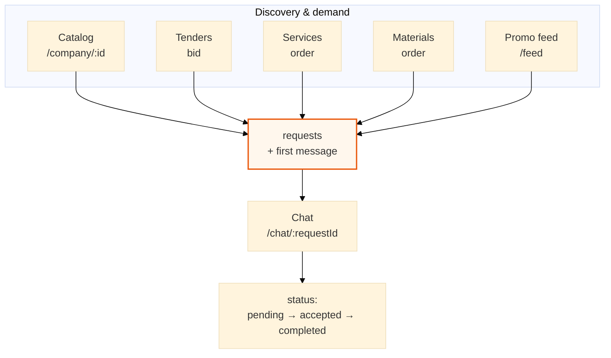

# 07 — Marketplace → request

**Purpose:** all user entry points that create the same deal primitive (`requests` + chat).

[← Frontend](06-frontend.md) · [Architecture hub](../ARCHITECTURE.md) · [Next: Authentication →](08-authentication.md)

---

## Diagram

### Описание для документации (Рисунок 8)

**Рисунок 8. Сценарии маркетплейса, сходящиеся в заявку.**

Разные разделы интерфейса (каталог, тендеры, витрины услуг и материалов, промо-лента) реализуют разный UX, но одну backend-модель: создаётся **заявка** и **первое сообщение**, далее ведётся **чат** и меняется **статус** сделки. Так достигается единый канал коммуникации между заказчиком и подрядчиком/поставщиком.

---

[Next: Authentication →](08-authentication.md)
