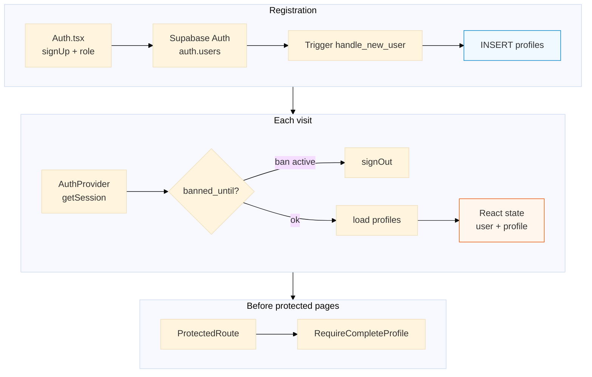

# 08 — Authentication & session

**Purpose:** sign-up, profile bootstrap, session, and access gates.

[← Marketplace](07-marketplace.md) · [Architecture hub](../ARCHITECTURE.md) · [Reference →](09-reference.md)

---

## Diagram

### Описание для документации (Рисунок 9)

**Рисунок 9. Аутентификация и контроль доступа.**

При регистрации роль пользователя передаётся в метаданные Supabase Auth; триггер в PostgreSQL создаёт запись в `profiles`. При каждом запуске приложения `AuthProvider` восстанавливает сессию JWT и загружает профиль; при активной блокировке выполняется выход. Перед защищёнными страницами проверяется наличие входа и заполненность обязательных полей профиля (имя, телефон, город).

Files: `src/contexts/AuthContext.tsx`, `src/pages/Auth.tsx`, `supabase/migrations/20240328000004_auto_profile.sql`.

---

[Reference tables →](09-reference.md)
